# 📦 재고관리시스템 (Inventory Management System)

## 프로젝트 소개

상품 등록부터 입출고 관리, 재고 현황 파악까지 재고 관리의 전 과정을 지원하는 웹 기반 시스템입니다. <br>
직관적인 대시보드와 통계 분석 기능을 통해 데이터 기반 의사결정을 돕고, 관리자 기능으로 사용자 권한을 효율적으로 관리할 수 있습니다.

<br>

## 프로젝트 개요

- 프로젝트 이름 : StockFlow
- 프로젝트 기간 : 2025.11.03 ~ 2025.11.17 (2주)
- 프로젝트 인원 : 1인 (개인 프로젝트)

<br>

## 프로젝트 목표

- Spring Boot를 활용한 웹 애플리케이션 개발 경험
- Spring Security Session 기반 인증 및 권한 관리 구현
- MyBatis를 활용한 데이터베이스 연동 및 CRUD 기능 구현
- Chart.js를 활용한 통계 데이터 시각화
- Thymeleaf 템플릿 엔진을 통한 동적 화면 구성

<br>

## 기술 스택

### FrontEnd
 


### BackEnd
  

### Database


### Tools
 


<br>

## 주요 기능

<details>
<summary><b>👤 회원 관리</b></summary>

- Spring Security 기반 로그인/로그아웃
- BCrypt 비밀번호 암호화
- 세션 기반 인증
</details>

<details>
<summary><b>👥 사용자 관리 (관리자 전용)</b></summary>

- 사용자 등록, 수정, 삭제
- 역할별 권한 관리 (일반/관리자)
- 사용자 목록 조회 및 검색
</details>

<details>
<summary><b>📦 상품 관리</b></summary>

- 상품 등록, 수정, 삭제 (CRUD)
- 상품코드 자동 생성 (PRD-YYYYMMDD-XXX)
- 카테고리별 분류 (전자/의류/식품/기타)
- 안전재고 설정 및 재고 상태 표시 (정상/부족/없음)
- 상품명/카테고리 검색 및 페이징
- 입출고 내역이 있는 상품 삭제 제한
</details>

<details>
<summary><b>📥 입고 관리</b></summary>

- 입고 등록 및 내역 조회
- 입고번호 자동 생성 (IN-YYYYMMDD-XXX)
- 입고 시 재고 자동 증가
- 공급업체 정보 관리
- 날짜 범위 검색 및 최신순 정렬
</details>

<details>
<summary><b>📤 출고 관리</b></summary>

- 출고 등록 및 내역 조회
- 출고번호 자동 생성 (OUT-YYYYMMDD-XXX)
- 출고 시 재고 자동 감소
- 재고 부족 시 출고 제한
- 출고사유 분류 (판매/폐기/반품/기타)
- 날짜 범위 검색 및 최신순 정렬
</details>

<details>
<summary><b>📊 재고 현황</b></summary>
  
- 전체 상품 재고 조회
- 재고 상태별 필터링 (정상/부족/없음)
- 카테고리별 필터 및 검색
- 재고 부족 상품 강조 표시
</details>

<details>
<summary><b>📈 통계 및 대시보드</b></summary>

- Chart.js 기반 데이터 시각화
- 기간별 입출고 현황 (바 그래프)
- 카테고리별 재고 현황 (파이 차트)
- 입출고 TOP 5 상품 분석
- 실시간 주요 지표 (총 재고, 오늘 입출고, 재고 부족 상품)
- 최근 입출고 내역 조회
</details>

<details>
<summary><b>📢 공지사항</b></summary>

- 공지사항 등록, 수정, 삭제 (관리자)
- 공지 구분 (일반/중요)
- 상단 고정 기능
- 파일 첨부 및 다운로드
- 댓글 작성 및 관리
- 조회수 자동 증가
</details>

<br>

## ERD

<br>
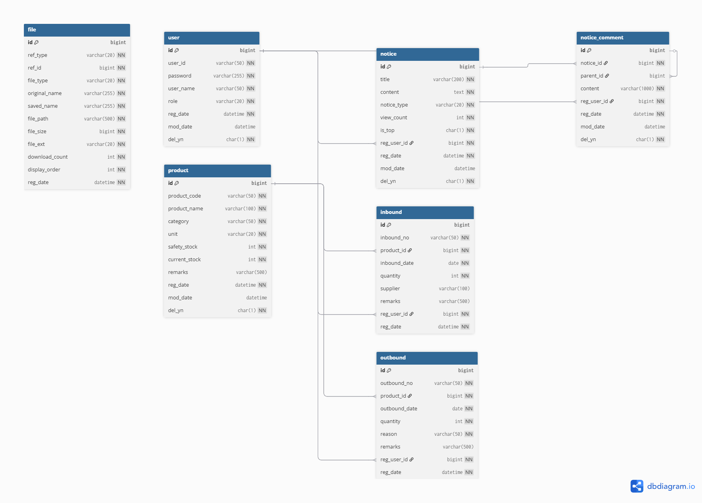

<br>

## 프로젝트 구조

```
src/
├── main/
│   ├── java/
│   │   ├── controller/       # 컨트롤러 계층
│   │   ├── domain/           # 엔티티 클래스
│   │   ├── dto/              # 데이터 전송 객체
│   │   ├── exception/        # 예외 처리
│   │   ├── mapper/           # Mybatis 인터페이스
│   │   ├── response/         # API 응답 객체
│   │   ├── security/         # Spring Security 설정
│   │   ├── service/          # 비즈니스 로직 계층
│   │   └── util/             # 유틸리티 클래스
│   └── resources/
│       ├── mapper/           # Mybatis XML 매퍼
│       ├── static/           # CSS, JS, 이미지
│       ├── templates/        # Thymeleaf 템플릿
│       └── application.yml   # 설정 파일
└── test/

```

<br>

## 화면 구성

|                                            로그인                                            |                                              대시보드                                              |
|:-----------------------------------------------------------------------------------------:|:----------------------------------------------------------------------------------------------:|
| 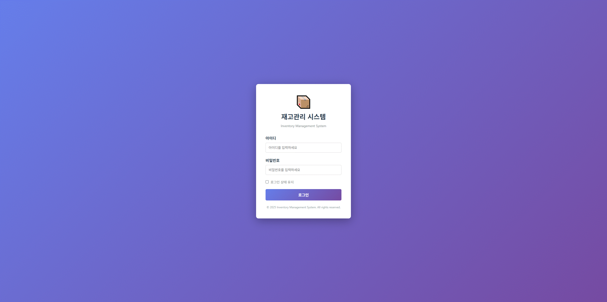 | 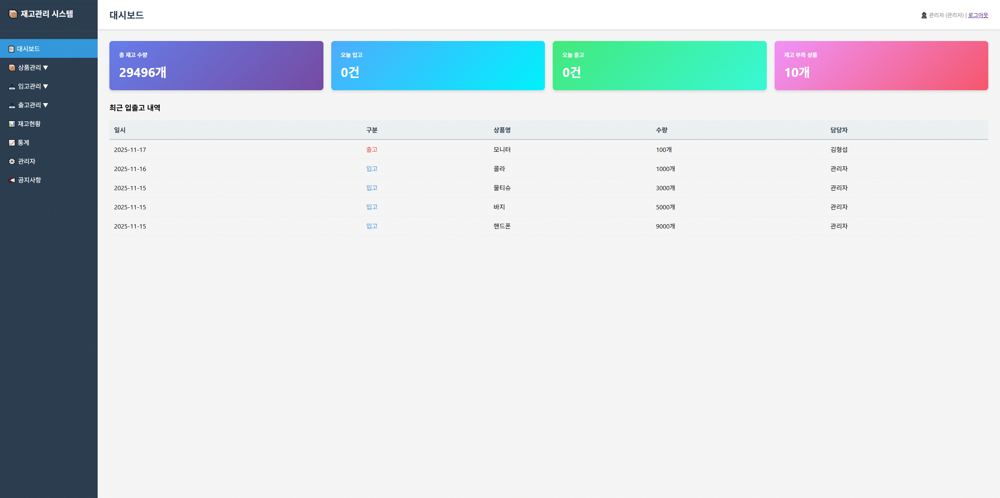 |

|                                              상품 목록                                               |                                              상품 등록                                              |
|:------------------------------------------------------------------------------------------------:|:-----------------------------------------------------------------------------------------------:|
| 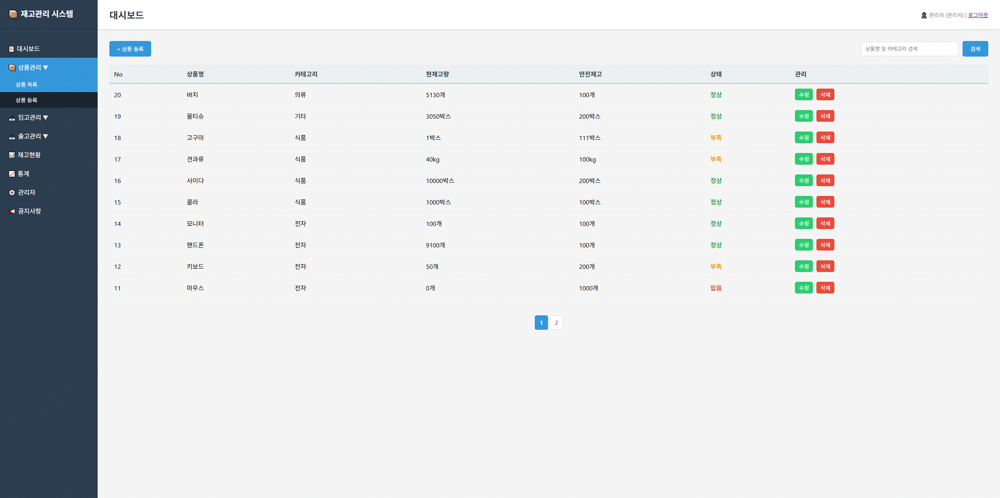 | 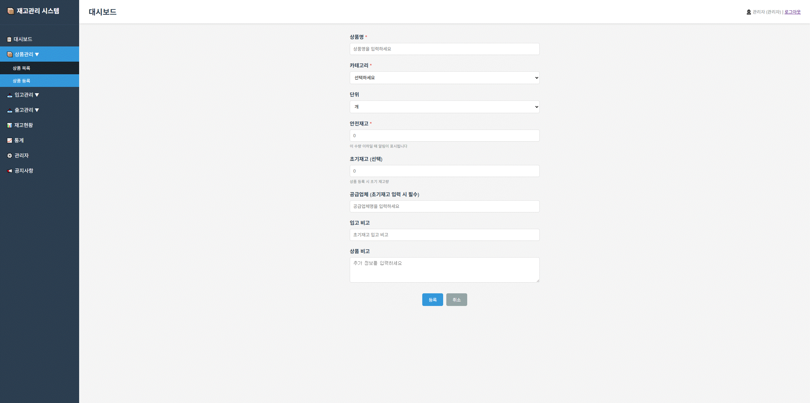 |

|                                              입고 내역                                               |                                              입고 등록                                              |
|:------------------------------------------------------------------------------------------------:|:-----------------------------------------------------------------------------------------------:|
| 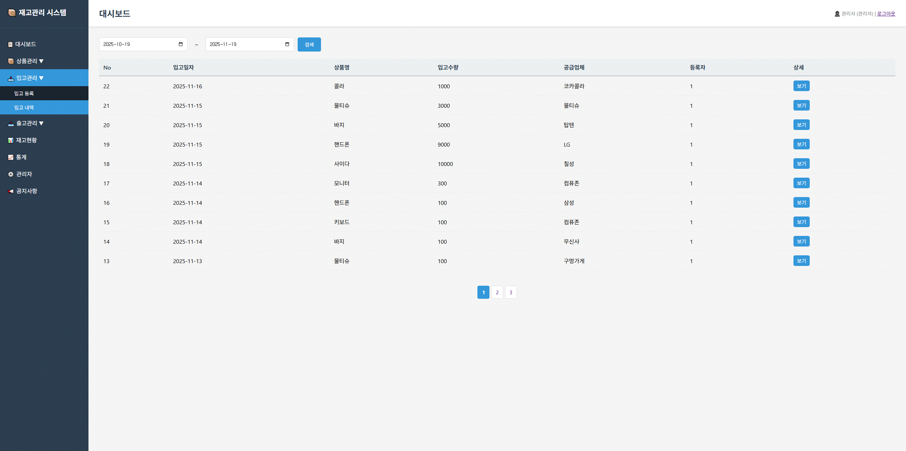 | 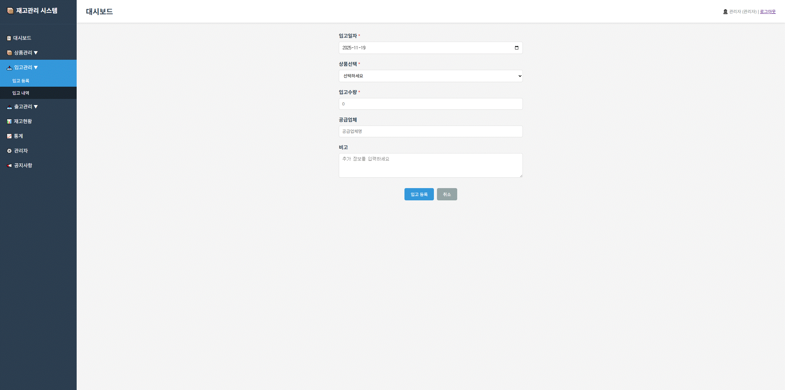 |

|                                               출고 내역                                               |                                              출고 등록                                               |
|:-------------------------------------------------------------------------------------------------:|:------------------------------------------------------------------------------------------------:|
| 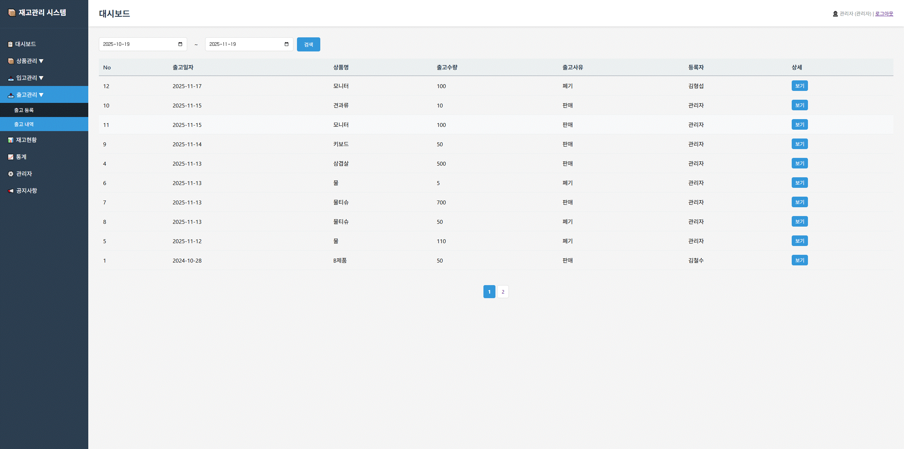 | 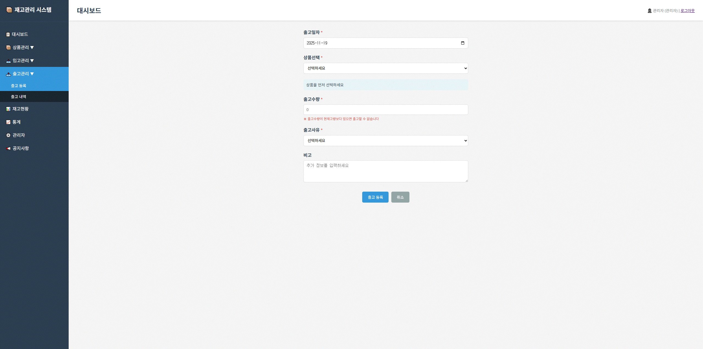 |

|                                               재고 현황                                                |                                              통계                                               |
|:--------------------------------------------------------------------------------------------------:|:---------------------------------------------------------------------------------------------:|
| 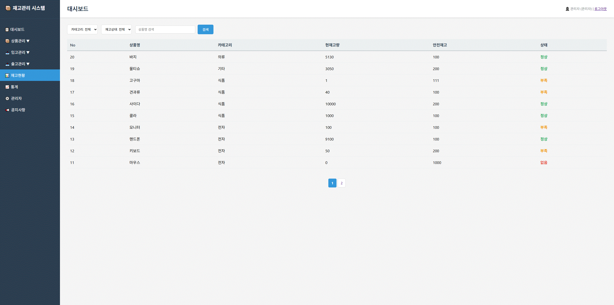 | 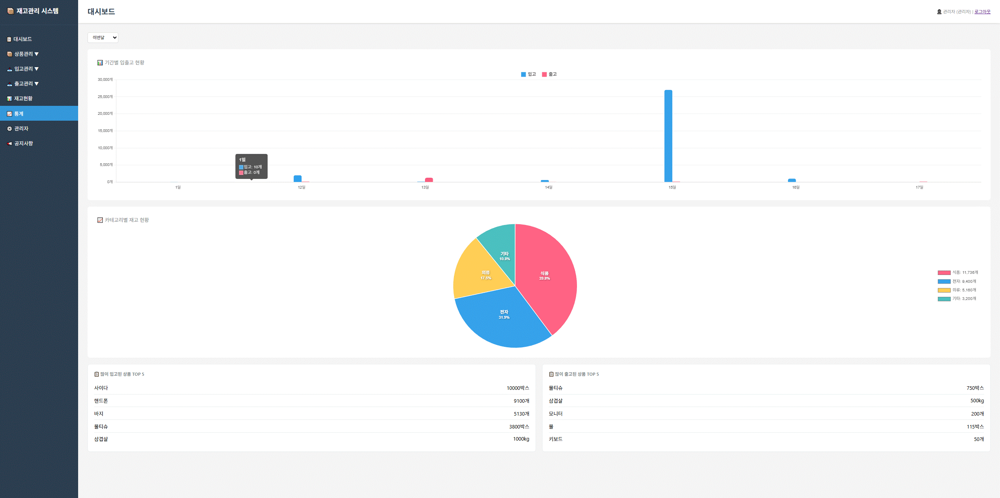 |

|                                          사용자 관리 (관리자)                                           |                                          사용자 추가 (관리자)                                          |
|:-----------------------------------------------------------------------------------------------:|:----------------------------------------------------------------------------------------------:|
| 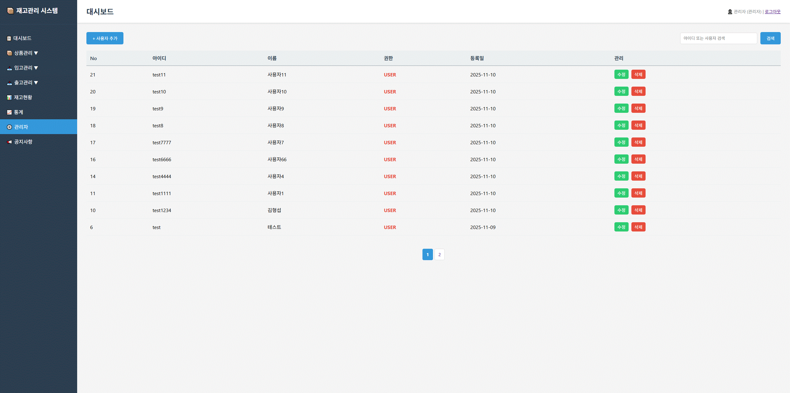 | 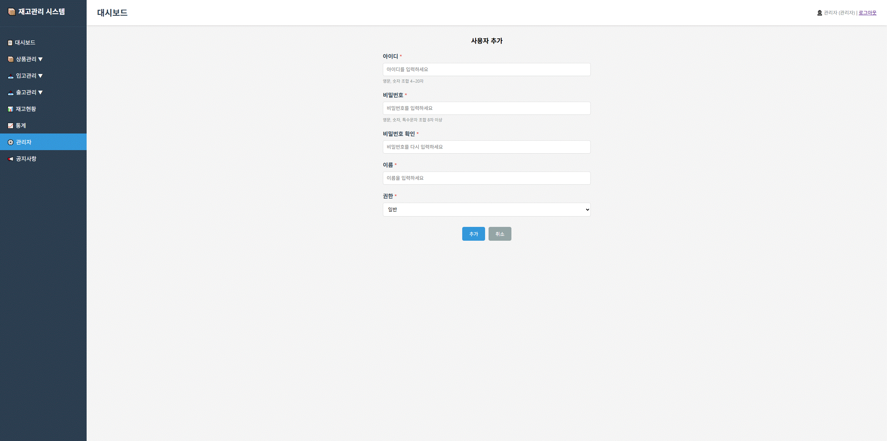 |

|                                              공지사항 목록                                              |                                             공지사항 등록                                              |
|:-------------------------------------------------------------------------------------------------:|:------------------------------------------------------------------------------------------------:|
| 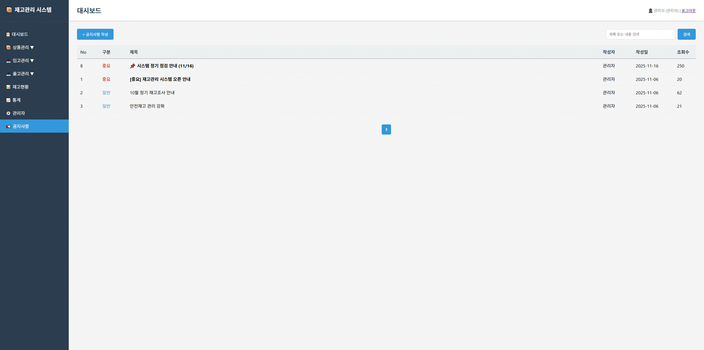 | 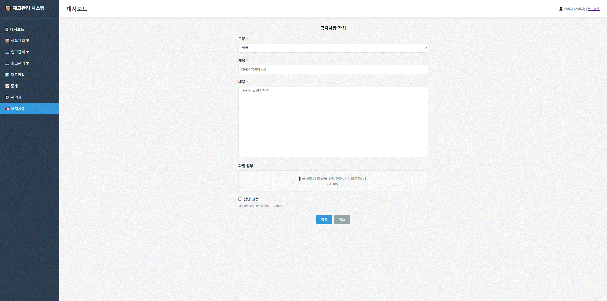 |
